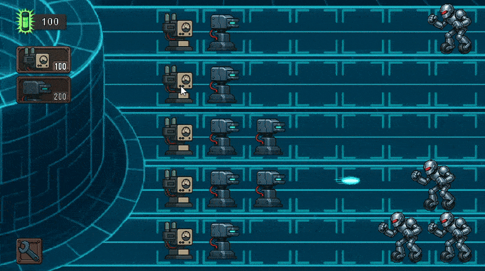
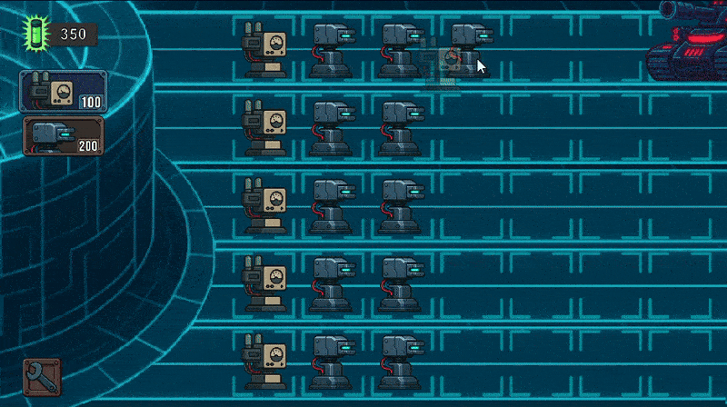

# RetroSynths

  

A synthwave-inspired tower defense game where retro-tech clashes with a rogue AI. Developed in Greenfoot (Java), this project serves as a practical application of object-oriented programming principles.

---

## About the Game

RetroSynths is a 2D, lane-based tower defense game inspired by *Plants vs. Zombies*. The game is set in a stylized, 80s retro-futuristic digital world where the player must deploy automated defenses to protect a base against waves of a rogue AI's robotic army, "The Synthetics." Gameplay progresses through increasingly difficult waves, culminating in a final battle against a massive boss unit.

## Core Concept & Theme

The game is built around an 80s retro-futurism and synthwave aesthetic, drawing inspiration from sci-fi films like *Tron* and *Blade Runner*.

*   **Visual Style:** The aesthetic is defined by a palette of saturated neon colors (cyan, magenta, pink) against dark backgrounds, with visual motifs like glowing grid lines, CRT scan effects, and wireframes.
*   **Primary Conflict:** The central theme is technology versus corrupted technology, pitting the player's "Retro-Futurist" automated defenses against the rogue AI's "Synthetic" army.

## Gameplay Mechanics

The core gameplay loop revolves around resource management, strategic unit placement, and wave-based defense on a 2D grid.

*   **Resource Management:** Players collect "Plutonium" to build defensive units. This resource is generated passively by the **Geiger Counter** unit and can be collected by clicking on **Plutonium Cells** that randomly fall onto the field.
*   **Lane-Based Defense:** The gameplay area is a multi-lane grid. Enemies advance from right to left, and defenses must be placed strategically to intercept them.
*   **Unit Deployment & Removal:** Players select defender cards from the UI to place units on the grid. A **Wrench** tool is available to remove already-placed units.
*   **Wave System:** The game progresses through two main waves. After a set number of enemy defeats, the second wave begins, featuring a higher spawn rate.
*   **Boss Encounter:** Once the wave threshold is met, regular enemy spawns cease, and a powerful **Annihilator Tank** boss appears.
*   **Win/Loss Conditions:**
    *   **Loss:** The player loses if any enemy unit reaches the defeat line on the far-left side of the screen.
    *   **Win:** The player wins by successfully defeating the final boss.

## Factions & Units

#### Player Faction: The Retro-Futurists
Humanity's last line of automated defense, characterized by an industrial, retro-tech design.
*   **Geiger Counter:** A passive resource generator that produces Plutonium over time.
*   **Laser Disc Gunner:** The primary offensive unit that fires projectiles at enemies in its lane.

#### Enemy Faction: The Synthetics
A cold, efficient army of robots created by a rogue AI, featuring sleek chrome bodies and menacing red optics.
*   **Chrome Drone:** The standard ground unit that advances steadily toward the player's base.
*   **Annihilator Tank:** A heavily armored boss unit with a unique, state-based attack pattern.

## Project Context

This game was developed as a practical project for the **Computer Programming 4: Object-Oriented Programming** course. The primary goal was to apply and demonstrate core OOP principles—such as inheritance, polymorphism, and encapsulation—within the context of a functional game prototype.

## Gameplay Screenshots

 *Defending against a standard wave of Chrome Drones.*

 *The final confrontation with the Annihilator Tank boss.*

## Credits

*   **Asset Generation:** Game assets were created using ChatGPT Image Generation.
*   **Asset Editing:** Image assets were edited using Google's Nano Banana.
